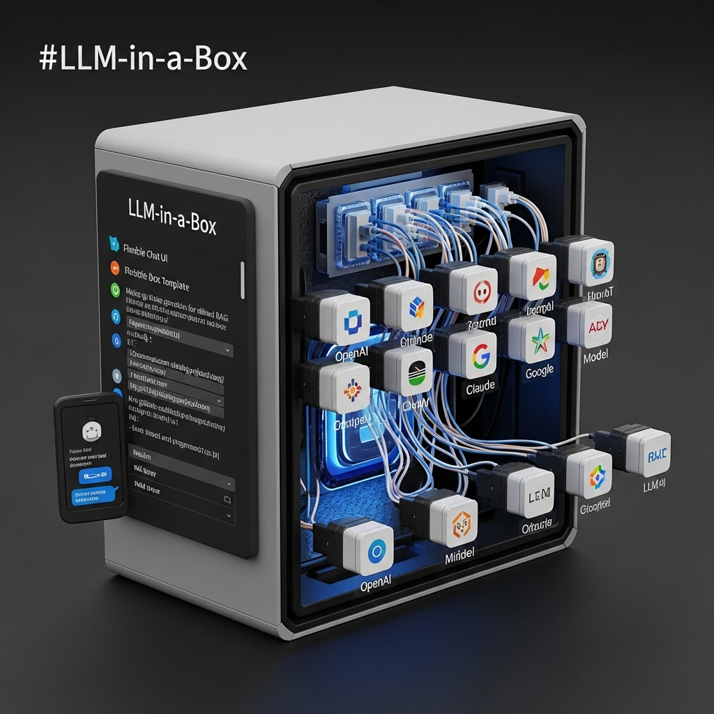

# LLM in a box template

This template provides an easy-to-deploy, self-hostable stack to make the generative AI ecosystem more approachable for research and education.
It unifies access to both commercial and local models (via Ollama) through a flexible chat UI and a single API endpoint, enabling private, reproducible, and sovereign AI workflows.

This template project contains:

- A **flexible Chat UI** [OpenWebUI](https://docs.openwebui.com/)
- **Document extraction** for refined RAG via [docling](https://docs.openwebui.com/features/document-extraction/docling)
  - https://github.com/docling-project/docling
  - https://github.com/docling-project/docling-serve
- A **model router** [litellm](https://www.litellm.ai/)
- A **model server** [ollama](https://ollama.com/)
- State is stored in Postgres https://www.postgresql.org/

This template is built with [cruft](https://cruft.github.io/cruft/) so it is easy to update.
Furthermore secrets are managed with [sops](https://github.com/getsops/sops) and [age](https://github.com/FiloSottile/age).
We use [traefik](https://traefik.io/traefik/) as a reverse proxy.



## Publication

This project is a contribution of the [Complexity Science Hub](https://complexity.science/) and is published under the [Apache License 2.0](https://www.apache.org/licenses/LICENSE-2.0).
This template project is published to [JOSE (journal of open source education)](https://jose.theoj.org/).
You find the DOI here: <<TODO finish publication>>>

The source code for the publication is availabe in the `docs/paper.md` file.

## Using the template

We intend to eventually have more deployment processes scaffolded. However, this is usually fairly specific for a given organization.
Therefore, we start out with `docker compose`.
And perhaps later will add soemthing for Kubernets with fluxcd.

You may want to customize a productiion grade deployment for SSL handling and SSO.
But we hope this gives you a good starting point.

See the [QUICKSTART.md](./docs/QUICKSTART.md) for an in-depth quick start guide.

### Prerequisites

You have a working installation of pixi available.

See https://pixi.sh/latest/ for installing. In short:

- osx/linux: `curl -fsSL https://pixi.sh/install.sh | sh`
- windows: `powershell -ExecutionPolicy ByPass -c "irm -useb https://pixi.sh/install.ps1 | iex"`

Furthermore, you must have some kind of container runtime installed.
For example:
- Docker Desktop https://www.docker.com/products/docker-desktop/
- Rancher Desktop https://rancherdesktop.io/
- Kubernetes
- Podman
- ...


### Applying the template
#### Docker (simple)
For now we assume you are using docker.

> NOTICE: Pixi will bootstrap most required tools i.e. git

```bash
pixi shell -e dev
git clone https://github.com/complexity-science-hub/llm-in-a-box-template.git
cd llm-in-a-box-template

pixi run tpl-init-cruft


# alternatively:
# pip install cruft jinja2-ospath
# cruft create git@github.com:complexity-science-hub/llm-in-a-box-template.git
```

Ensure you have checked out vllm (afterwards):

```
git clone --branch v0.9.2 --depth 1 https://github.com/vllm-project/vllm.git services/model-server/vllm
```

Now set up your secrets in the `.env` file.
See a template below.

```
ROOT_DOMAIN=llminabox.geoheil.com
CLOUDFLARE_IPS=173.245.48.0/20,103.21.244.0/22,103.22.200.0/22,103.31.4.0/22,141.101.64.0/18,108.162.192.0/18,190.93.240.0/20,188.114.96.0/20,197.234.240.0/22,198.41.128.0/17,162.158.0.0/15,104.16.0.0/13,104.24.0.0/14,172.64.0.0/13,131.0.72.0/22
LOCAL_IPS=127.0.0.1/32,10.0.0.0/8,192.168.0.0/16,172.16.0.0/12
TZ=Europe/Vienna

# openssl rand -hex 32 for each
LLM_ROUTER_DB=llm_router_db
LLM_ROUTER_DB_USER=llm_router_db_user
LLM_ROUTER_DB_PASSWORD=somepassword
LITELLM_MASTER_KEY=somepassword
LITELLM_SALT_KEY=somepassword
LITELLM_UI_USERNAME=admin
LITELLM_UI_PASSWORD=somepassword

ROUTER_OPENAI_API_KEY=sk-sometoken
ROUTER_ANTHROPIC_API_KEY=sk-someothertoken

CHAT_UI_DB=chat_ui_db
CHAT_UI_DB_USER=chat_ui_db_user
CHAT_UI_DB_PASSWORD=somepassword
CHAT_UI_SECRET_KEY=somepassword

QDRANT__SERVICE__API_KEY=somepassword
```


Finally, start the servies


```bash
# cpu
docker compose --profile llminabox --profile ollama-cpu --profile docling-cpu --profile vectordb-cpu up -d

# gpu
docker compose --profile llminabox --profile ollama-gpu --profile docling-gpu --profile vectordb-cpu up -d

docker compose logs -f
```

finally in your browser navigate to:

- connect to the model server (ollama via docker)
  - choose a suitable model from https://ollama.com
  - pull it `docker exec -it ollama ollama pull gemma3:4b`
  - verify it is here `docker exec -it ollama ollama ls`
- Set up the model router available at http://llm.llminabox.geoheil.com/ui
  - log in with the credentials set up in the `.env` file from above
  - register the model: Ensure that []()
    ```bash
    - model_name: "gemma3:4b"
    litellm_params:
      model: "ollama_chat/gemma3:4b"
      api_base: "http://ollama:11434"
    ```
   - possibly modify other model registrations
     - ensure you have API keys for all the models you want to use
     - Openai
     - Claude
     - Gemini
     - VertexAI: make sure to set the right google cloud project
   - stop and restart the model router
   - go to http://llm.llminabox.geoheil.com/ui
   - verify in the UI the model is detected
   - create a new API key (we will use that later in the chat UI)
     - name: `llminabox`
     - select the desired models (i.e. all for now)
     - possibly add some restrictions such as budget, rate limit, expiration, etc.
  - verify the desired models work in the llm playground http://llm.llminabox.geoheil.com/ui/?page=llm-playground
- Lets make this now available for end users. We use Openwebui as a chat UI: http://chat.llminabox.geoheil.com
  - create a user (use some more sensible credentials)
    - admin
    - admin@example.com
    - test
  - mail delivery is not set up by default - you have to set up according to your own organization's needs.
  - in the admin settings
  - ensure the right model connection is defined - see http://chat.llminabox.geoheil.com/admin/settings/connections
  - under openai compatible - create a new connection
    - connection URL: `http://llmrouter:4000/v1`
    - api key: the one you created above
    - ensure the default openai API is disabled - and all traffic goes through the model router
- Litelm model router: llm.llminabox.geoheil.com

#### Kubernetes (advanced)

This is a more advanced setup.
We use [fluxcd](https://fluxcd.io/) and and [k3s](https://k3s.io/).


For details see [Advanced setup](./docs/setup-advanced-k3s-fluxcd.md).

> TODO: This is a work in progress. And will be updated in the future. For now, only the docker-compose based setup is available.

## Contribution

Feel free to contribute - issues & even better pull requests are welcome.

### Developing the template

To render an instance of the project:
```bash
pixi run render-dev
```

see [rendered-template/*](rendered-template) for an example of how the peoject might look like.

```bash
# brings up the CPU template quickly
pixi run start-template
```
