# LLM-in-a-Box Architecture & Ecosystem

## Architecture Diagram

```mermaid
flowchart TB
  %% Core Services (Blue Box)
  subgraph Core ["Core Services"]
    direction TB
    
    Traefik["Traefik<br/>(Reverse Proxy)"]
    
    subgraph CoreMain ["Main Services"]
      direction LR
      OpenWebUI["OpenWebUI<br/>(Chat UI)"]
      Docling["Docling<br/>(Document Extraction)"]
    end
    
    subgraph CoreBackend ["Backend Services"]
      direction LR
      LiteLLM["LiteLLM<br/>(Model Router)"]
      Ollama["Ollama<br/>(Model Server)"]
    end
    
    Postgres["Postgres<br/>(State DB)"]
  end
  
  %% Addon Services (Yellow Box)
  subgraph Addons ["Addon Services"]
    direction TB
    
    subgraph AddonsTop ["Infrastructure"]
      direction LR
      API["API Gateway<br/>(e.g. Kong)"]
      Monitoring["Monitoring<br/>(Prometheus/Grafana)"]
      SSO["SSO/Identity<br/>(Keycloak)"]
    end
    
    subgraph AddonsMiddle ["Data & Storage"]
      direction LR
      FileStore["Object Storage<br/>(MinIO/S3)"]
      Qdrant["Qdrant<br/>(Vector DB)"]
      DataViz["Data Visualization<br/>(Metabase)"]
    end
    
    subgraph AddonsBottom ["Workflow & Automation"]
      direction LR
      Workflow["Workflow Engines<br/>(Temporal)"]
      Notebooks["Jupyter/Polynote<br/>(Notebooks)"]
      n8n["n8n<br/>(Automation)"]
    end
  end
  
  %% Core Internal Connections
  Traefik --> OpenWebUI
  Traefik --> Docling
  Traefik --> LiteLLM
  Traefik --> Ollama
  
  OpenWebUI -->|API| LiteLLM
  OpenWebUI -->|State| Postgres
  
  Docling -->|RAG| LiteLLM
  Docling -->|State| Postgres
  
  LiteLLM -->|Model API| Ollama
  LiteLLM -->|State| Postgres
  
  %% Addon to Core Connections (with labels)
  API -.->|"Proxy"| Traefik
  Monitoring -.->|"Metrics"| Traefik
  Monitoring -.->|"Health"| OpenWebUI
  Monitoring -.->|"Performance"| LiteLLM
  Monitoring -.->|"Resources"| Ollama
  Monitoring -.->|"Database"| Postgres
  
  SSO -.->|"Auth"| Traefik
  SSO -.->|"Login"| OpenWebUI
  
  FileStore -.->|"Documents"| Docling
  FileStore -.->|"Models"| Ollama
  
  Qdrant -.->|"Vector Search"| Docling
  Qdrant -.->|"Embeddings"| LiteLLM
  
  DataViz -.->|"Analytics"| Postgres
  
  Workflow -.->|"Orchestration"| Docling
  Workflow -.->|"Model Calls"| LiteLLM
  Workflow -.->|"Inference"| Ollama
  
  Notebooks -.->|"Data Processing"| Docling
  Notebooks -.->|"Model Testing"| LiteLLM
  Notebooks -.->|"Experiments"| Ollama
  Notebooks -.->|"Analysis"| Postgres
  
  n8n -.->|"Automation"| Docling
  n8n -.->|"API Integration"| LiteLLM
  n8n -.->|"Model Pipeline"| Ollama
  n8n -.->|"Data Sync"| Postgres
  
  %% Styling
  classDef core fill:#e3f2fd,stroke:#1976d2,stroke-width:3px,color:#0d47a1
  classDef addon fill:#fff8e1,stroke:#f57c00,stroke-width:2px,color:#e65100
  classDef coreMain fill:#bbdefb,stroke:#1976d2,stroke-width:2px
  classDef coreBackend fill:#90caf9,stroke:#1976d2,stroke-width:2px
  classDef addonTop fill:#ffecb3,stroke:#f57c00,stroke-width:2px
  classDef addonMiddle fill:#ffe0b2,stroke:#f57c00,stroke-width:2px
  classDef addonBottom fill:#ffcc02,stroke:#f57c00,stroke-width:2px
  
  class Core core
  class Addons addon
  class CoreMain coreMain
  class CoreBackend coreBackend
  class AddonsTop addonTop
  class AddonsMiddle addonMiddle
  class AddonsBottom addonBottom
```

---

## Layered Stack: Core, Addons, and Extensions

### Core (Turnkey, Always Included)
- **Reverse Proxy**: Traefik (or Nginx)
- **Chat UI**: OpenWebUI (or similar)
- **Model Router**: LiteLLM (or OpenRouter, vLLM)
- **Model Server**: Ollama (or LM Studio, vLLM, TGI)
- **Document Extraction**: Docling (for RAG)
- **State DB**: Postgres

### Addons (Quick-Add, Highly Recommended)
- **Vector DB**: Qdrant, Milvus, Weaviate, or Chroma
- **Automation/Orchestration**: n8n, Apache Airflow
- **SSO/Identity**: Keycloak, Authentik, or Auth0
- **Monitoring/Observability**: Prometheus, Grafana, Loki
- **Object/File Storage**: MinIO, S3
- **Notebooks**: Jupyter, Polynote
- **Data Visualization**: Metabase, Superset
- **Workflow Engines**: Temporal, Argo Workflows
- **API Gateway**: Kong, Ambassador

### Extensions/Specializations (Optional, Use-Case Driven)
- **Fine-tuning/Training UI**: LoRA Studio, Hugging Face AutoTrain
- **Agent Frameworks**: LangChain, CrewAI, AutoGen
- **Data Labeling**: Label Studio
- **ML Experiment Tracking**: MLflow, Weights & Biases
- **RAG Frameworks**: LlamaIndex, Haystack
- **Search**: OpenSearch, Elasticsearch
- **Chatbot Integrations**: Slack, Discord, Teams, Webhooks
- **Analytics**: Amplitude, PostHog
- **Security**: Vault, SOPS, OPA

---

## What Could Be Added (Batteries-Included Recommendations)

- **Automation/Workflow**: n8n for connecting LLM outputs to external systems (email, Slack, databases, etc.)
- **Vector DB**: Qdrant or Milvus for scalable RAG
- **SSO/Identity**: Keycloak for enterprise auth
- **Monitoring**: Prometheus/Grafana for health, usage, and cost tracking
- **Object Storage**: MinIO for document and data storage
- **Notebook Environment**: Jupyter for data science workflows
- **Data Labeling**: Label Studio for supervised fine-tuning
- **Experiment Tracking**: MLflow for model versioning and metrics
- **API Gateway**: Kong for rate limiting, auth, and multi-tenancy
- **Agent/Workflow Frameworks**: LangChain, CrewAI for advanced automation
- **Analytics**: PostHog for user and system analytics

---

## Core vs. Addons/Extensions

- **Core**: Should always be present for a functional, private, multi-model LLM stack (UI, router, model server, DB, proxy, doc extraction)
- **Addons**: Should be one-command add (docker-compose, helm, etc.), and cover most common needs (vector db, SSO, monitoring, storage, automation)
- **Extensions**: For advanced users, research, or verticals (fine-tuning, analytics, agent frameworks, integrations)

---

## Similar Projects & Inspiration

### 1. [philschmid/open-llm-stack](https://github.com/philschmid/open-llm-stack)
- Focus: Production-ready open LLM stack (HuggingChat, TGI, MongoDB, Langchain, vLLM, OpenSearch)
- Modular, cloud/on-prem, with examples for different providers

### 2. [tmc/mlops-community-llm-stack-hack](https://github.com/tmc/mlops-community-llm-stack-hack)
- Focus: MLOps community hackathon starter for LLM stacks
- Includes Go backend, Python services, vector visualization, Slack monitoring

### 3. [godatadriven/openllm-starter](https://github.com/godatadriven/openllm-starter)
- Focus: GPU infra provisioning, Streamlit chat, Jupyter, GCP automation
- Good for quickstart on cloud GPU

### 4. [aishwaryaprabhat/BigBertha](https://github.com/aishwaryaprabhat/BigBertha)
- Focus: LLMOps on Kubernetes (ArgoCD, Argo Workflows, Prometheus, MLflow, MinIO, Milvus, LlamaIndex)
- End-to-end retraining, monitoring, vector ingestion

### 5. [IceBearAI/LLM-And-More](https://github.com/IceBearAI/LLM-And-More)
- Focus: Plug-and-play, full LLM workflow (data, training, deployment, evaluation)
- Modular, professional, with UI and workflow orchestration

---

## Summary

- **This template** covers the core stack for private, multi-model LLM workflows.
- **To be truly "batteries included"**, consider integrating vector DB, automation/orchestration, SSO, monitoring, object storage, and notebook/data science tools as quick-add modules.
- **For inspiration and advanced features**, see the above projects—many are modular and open source, and can be referenced for best practices and further integrations. 